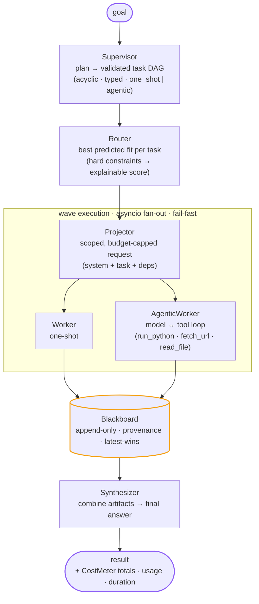

# Volante

[](https://github.com/ribato22/volante/actions/workflows/ci.yml)
[](https://github.com/ribato22/volante/blob/main/LICENSE)
[](pyproject.toml)
[](https://pypi.org/project/volante/)
[](https://registry.modelcontextprotocol.io)
[](https://github.com/astral-sh/ruff)

**A transparent, user-owned model router and orchestration control plane (alpha).** A *supervisor*
model decomposes a goal into a task DAG, *routes* each sub-task across the user's explicitly
configured models, runs them one-shot or in an agentic tool loop, and *synthesizes* a final answer.
Hard capabilities are enforced first; explainable metadata and quality evidence rank the eligible
models. Volante runs locally and keeps inventory, policy, credentials, and decision traces under the
user's control.

Selection quality is an evidence-based prediction, not a claim of a universal winner. Volante does
not yet ship published representative cross-provider benchmarks or automatic score calibration.
Built without an orchestration framework (no LangChain / CrewAI / LiteLLM).

> A *volante* steers the game: the deep-lying midfielder who reads the whole pitch and sends the
> ball where it does the most good — then takes it back. One mind, many players.

---

## Highlights

- **Supervisor + explainable routing.** An LLM plans a validated, acyclic task DAG; the router
  evaluates every configured model, rejects hard capability mismatches, scores the eligible set,
  and records the complete decision trace. Optional evaluation-derived quality profiles replace
  coarse metadata with evidence. `quality`, `local`, `cheap`, and `cash_protect_quota` are distinct
  routing objectives.
- **User-owned, cross-provider control plane.** `AnthropicProvider` and a generic
  `OpenAICompatProvider` speak to Anthropic, Google AI Studio (Gemini), Groq, OpenRouter, DeepSeek,
  Moonshot (Kimi), local Ollama, and any other OpenAI-compatible endpoint. The inventory and
  credentials stay in the user's environment.
- **Scoped provider failover.** Model/deployment, provider authentication/endpoint, exhausted-retry,
  and timeout failures are recorded and can move work to the next ranked eligible candidate,
  including planner/synthesizer fallbacks. Malformed or semantically invalid requests still fail
  fast instead of spraying the request across providers.
- **Hybrid one-shot / agentic.** Tasks run as a single call *or* as a model↔tool loop (`run_python`
  in a Docker-isolated sandbox when a daemon is available, withheld when none is — plus host-mediated
  `fetch_url` / `read_file`).
- **Shared context.** An append-only *blackboard* carries provenance; each task gets a scoped,
  budget-capped projection of only the dependency artifacts it needs.
- **Streaming everywhere.** Live token streaming through the supervisor, workers, and synthesizer,
  with per-task labels for parallel workers and cooperative early-stop.
- **Optional Web UI.** A small FastAPI + SSE app streams a run live in the browser (plan → per-task
  worker output → synthesis → result); runs with real providers or a no-key demo.
- **Cost & honesty.** A `CostMeter` tallies per-model usage and cost, and propagates an *estimated*
  flag when a provider returns no usage.
- **Forgery-resistant evaluation.** A 3-arm eval (baseline vs. orchestration vs. single-agent) with
  a scorer that runs untrusted solution code under **process + filesystem separation** so a model
  cannot fake a passing score.
- **Tested.** 800+ tests, zero-network by default (`FakeProvider` + local subprocesses), `ruff`-clean.

## Architecture



<details>
<summary>Text version (renders anywhere, e.g. PyPI or a terminal)</summary>

```text
                    ┌──────────────┐
   goal ──────────► │  Supervisor  │  plan → validated task DAG (acyclic, typed, one_shot|agentic)
                    └──────┬───────┘
                           ▼
                    ┌──────────────┐   per task: hard-capability filter, then rank the
                    │    Router    │   predicted fit from configured evidence
                    └──────┬───────┘
                           ▼
        ┌───────────── wave execution (asyncio, fan-out cap, fail-fast) ─────────────┐
        │   ┌───────────┐   scoped, budget-capped request (system + task + deps)      │
        │   │ Projector │──────────────────────────────────────────────────────────► │
        │   └───────────┘                                                             │
        │        ▼                              ▼                                      │
        │   ┌─────────┐  one-shot          ┌───────────────┐  model↔tool loop         │
        │   │ Worker  │                    │ AgenticWorker │  (run_python sandbox,     │
        │   └────┬────┘                    └───────┬───────┘   fetch_url, read_file)   │
        │        └──────────────┬──────────────────┘                                   │
        └───────────────────────┼───────────────────────────────────────────────────┘
                                 ▼
                    ┌──────────────────────┐   append-only, provenance, latest-wins
                    │  Blackboard          │◄──────────────────────────────────────
                    └──────────┬───────────┘
                               ▼
                    ┌──────────────┐
                    │ Synthesizer  │  combine artifacts → final answer
                    └──────┬───────┘
                           ▼
                        result  (+ CostMeter totals, usage, duration)
```

</details>

| Component | File | Responsibility |
|---|---|---|
| Supervisor | `src/volante/supervisor.py` | Decompose goal → validated task DAG |
| Router | `src/volante/router.py` | Whole inventory → eligible candidates → explainable ranking |
| Projector | `src/volante/projector.py` | Scoped, budget-capped request from blackboard artifacts |
| Worker | `src/volante/worker.py` | One-shot model call |
| AgenticWorker | `src/volante/agent.py` | Model↔tool loop with per-turn records |
| Blackboard | `src/volante/blackboard.py` | Append-only shared state with provenance |
| Synthesizer | `src/volante/synthesizer.py` | Artifacts → final answer |
| Runtime | `src/volante/runtime.py` | Orchestrate: plan → waves → synthesize (streaming, fail-fast) |
| Providers | `src/volante/providers/` | Anthropic + OpenAI-compatible adapters (complete/stream/tools) |
| Tools | `src/volante/tools/` | Sandbox / DockerSandbox, run_python, fetch_url, read_file |
| Eval | `eval/` | 7 goals (5 katas + 2 multi-part), 3-arm comparison, forgery-resistant scorer |

## Quickstart

Requires **Python 3.11+** and [`uv`](https://docs.astral.sh/uv/).

```bash
git clone https://github.com/ribato22/volante
cd volante
uv sync --dev            # install deps + dev tools
uv run pytest            # 800+ tests, no network
uv run ruff check .      # lint

# See it orchestrate end-to-end with ZERO API keys (FakeProvider demo):
uv run python examples/fake_provider.py
```

Then configure at least one real provider (see [Providers](#providers)) and run a demo:

```bash
cp .env.example .env     # fill in one provider, then `set -a; . .env; set +a`

uv run python demo.py               # show detected providers
uv run python demo.py orchestrate   # full supervisor → workers → synth, streamed live
uv run python demo.py agentic       # one cross-provider agentic coding task (run_python loop)
uv run python demo.py eval          # 3-arm eval suite
```

### Example output

`demo.py orchestrate` streams every phase live, then prints the result (illustrative):

```text
Orchestrate demo — planner/synth model=openai/gpt-4o-mini

(planning + workers + synthesis stream live)
[haiku] Threads run as one— / tasks bloom in parallel time, / the join gathers all.

STATUS: success

FINAL:
Threads run as one—
tasks bloom in parallel time,
the join gathers all.

cost: $0.001834
```

`demo.py eval` prints the 3-arm table (`format_report`). Here is what it actually printed on the
last full run — **orchestration lost**:

```text
GOAL            WINNER          BASE   ORCH   AGEN
--------------------------------------------------
slugify         baseline        1.00   1.00   0.48
roman           baseline        1.00   0.80   0.70
calc            baseline        0.99   0.86   0.27
csv_stats       baseline        1.00   0.84   0.88
json_flatten    baseline        1.00   0.80   0.70
textkit         baseline        1.00   1.00   0.42
ledger          baseline        1.00   1.00   0.88
toolbelt        baseline        1.00   1.00   0.70
debug_gauntlet  orchestration   0.93   0.97   0.63
--------------------------------------------------
wins: baseline=8  orchestration=1  agentic=0  ties=0
totals: baseline $0.029908  orchestration $0.218879  agentic $0.135432
VERDICT: BASELINE
```

`openai/gpt-4o-mini`, 9 goals x 3 arms x k=5 = 135 real runs against a Docker sandbox.
Orchestration cost **7.3x** baseline and took **4.7x** as long, and tied or lost everywhere but one
goal. Those numbers were read from `results-nudge2.json`, the self-describing artifact the run
writes (models, k, per-goal scores, costs).

Reproduce it — this needs your keys and **spends real money**:

```bash
uv run python -m eval.run --k 5 --json results.json
```

**Read that verdict with its limits, because they are large.** Baseline scored a perfect 1.00 on 7
of the 9 goals, so on most of this suite there was no headroom to win at all: what the run
establishes is *"orchestration does not help on tasks one model already solves in a single turn"* —
much narrower than the claim the idea rests on. The one orchestration win, `debug_gauntlet`, is the
one goal written so the answer is easier to find by **running** code than by reading it, and its
margin is 0.04 on a single goal at k=5 — directional, not proof. The agentic arm still failed 3 of
its 45 runs. All of it is one model on one class of small coding tasks; whether orchestration pays
off for a stronger model, a larger task, or work that genuinely exceeds one context window is
**unmeasured, and this project does not claim it.**

The benchmark's most useful output so far was not the score. It found three real engine bugs — a
deterministic livelock in the agentic loop, an eval arm that failed a model for answering correctly
without calling a tool, and a stall guard that gave up after one warning when a second one recovers
the run — and fixing those took agentic terminal failures from 79% to 7%. It also refuted two of
the author's own hypotheses (that a wider goal would break the ceiling effect; that raising the
iteration cap would help). That is what the suite is for.

## Usage

Volante ships three surfaces: a one-command **CLI** (the primary entrypoint), an optional **Web UI**,
and an importable **library**. All three need at least one configured provider — see
[Providers](#providers) — or (Web UI only) fall back to a no-key demo.

### CLI (primary)

```bash
uv run volante "write a haiku about concurrency, then explain the metaphor"
```

`volante` streams the plan, each parallel worker's output (labelled per task), and the synthesis live,
then prints a summary. Flags (`volante --help`):

| Flag | Description |
|---|---|
| `--prefer {quality,cash_protect_quota,local,cheap}` | routing objective. `quality` (default) ranks predicted task fit; `cash_protect_quota` reserves subscription quota; `local` prioritizes eligible local models; `cheap` prioritizes configured economic cost |
| `--provider NAME` / `-P NAME` | restrict the planner/synth baseline to this provider |
| `--model ID` | override the planner/synth `model_id` |
| `--list-models` | print the complete configured/detected routing inventory and exit; combine with `--json` for machine-readable output |
| `--usage` | print the recent usage ledger (`~/.volante/usage.jsonl`) — including runs delegated from an IDE via MCP — and exit; combine with `--json` |
| `--json` | print the run summary as one parseable JSON line; disables streaming |
| `--no-stream` | disable live streaming of plan/worker/synth text |
| `--version` | print the installed version and exit |

Exit codes: `0` success, `1` run failure, `2` config error (e.g. no provider configured), `130`
Ctrl-C (prints whatever partial output had streamed so far — never a raw traceback).

The summary reports `billed_usd` (real cash spent) vs. `credit_usd` (subscription/plan
API-equivalent value, not cash), physical `subscription_calls`, and a per-task route trace. JSON
mode also includes every eligible/rejected candidate, score component, selected model, and model
actually executed after any fallback.

### Web UI

```bash
uv sync --extra ui
uv run python -m webui          # then open http://127.0.0.1:8000
```

A small FastAPI + Server-Sent-Events app streams a run live in the browser — the plan, each parallel
worker's output (labelled per task), the synthesis, and the final result with cost and model routes.
It runs with your configured providers, or a built-in `FakeProvider` demo if none are set (no API
key needed). This is a **source-checkout feature** — `webui/` is not shipped in the built wheel/PyPI
package.

`VOLANTE_UI_HOST` / `VOLANTE_UI_PORT` override the bind address. Volante refuses a non-loopback host
unless `VOLANTE_UI_AUTH_TOKEN` is set; for remote access also set `VOLANTE_UI_ALLOWED_HOSTS` to the
comma-separated hostnames clients will use. `VOLANTE_UI_MAX_GOAL_CHARS` (default `20000`) and
`VOLANTE_UI_MAX_CONCURRENT_RUNS` (default `2`) bound input and concurrency. The page inserts all
model output via `textContent` only (never raw HTML), so streamed text cannot inject markup. A
`/usage` page (linked from the header, gated by the same `VOLANTE_UI_AUTH_TOKEN`) shows the usage
ledger below.

### Monitoring usage

Every run from the CLI, the Web UI, and the **MCP server** best-effort appends one JSON line to a
usage ledger — `~/.volante/usage.jsonl` by default (`VOLANTE_USAGE_LOG` to relocate, empty to disable) —
recording status, cash vs. plan credit, physical subscription calls, duration, the models used, and
a truncated goal. This is how you monitor Volante when an IDE agent delegates goals to it over MCP:

```bash
uv run volante --usage            # recent runs + totals, newest first
uv run volante --usage --json     # the same as one JSON object
```

The Web UI `/usage` dashboard reads the same ledger (summary tiles + a recent-runs table). Set
`VOLANTE_LOG=debug` (or `info`/`warning`/`error`) to raise engine diagnostics on stderr — for an MCP
server that surfaces in the client's server-output pane (e.g. VS Code's **Output** → the Volante MCP
server); it is silent by default and never writes to stdout.

### Library

```python
import asyncio
import volante


async def main() -> None:
    registry, providers, model_id = volante.build_providers_from_env()
    factory = await volante.make_verified_runtime_factory(
        registry, providers, model_id
    )
    runtime = factory()
    result = await runtime.aexecute("your goal")
    print(result.status, result.billed_usd, result.credit_usd, result.cost_estimated)


asyncio.run(main())
```

A `Runtime` is **single-use**: it runs one goal, and its accounting, route trace, and planner are
all per-run. Call `factory()` again for each goal (a second or overlapping `aexecute` on the same
instance is refused with a `RuntimeError` rather than silently mixing two runs' numbers). Read
`result.cost_estimated` alongside the amounts — it is `True` when a provider reported no token
counts for at least one call, so part of the figures is inferred from configured rates rather than
reported by the provider.

The top-level `volante` package re-exports the common library API (`Runtime`, `Registry`,
`Router`, `RoutingDecision`, `ModelQualityProfile`, inventory helpers,
`build_providers_from_env`, `make_verified_runtime_factory`, `RunResult`, `ModelInfo`, `Task`,
`LLMProvider`, `ProviderError` — see `volante.__all__`) so you don't need to reach into submodules.

See [`examples/`](examples/) for runnable scripts — including
[`examples/fake_provider.py`](examples/fake_provider.py), which needs **no API key** at all. For a
guided tour with hardcoded goals, see the demo script:
`uv run python demo.py orchestrate|agentic|eval` (walked through in [Quickstart](#quickstart)).

### Using your Claude / ChatGPT subscription (no API key)

Volante can drive the *official headless CLIs* you're already logged into instead of (or alongside) a
card-billed API key:

```bash
export CLAUDE_CODE_ENABLED=1               # needs `claude` installed and logged in
# CLAUDE_CODE_SYSTEM_PROMPT_MODE=replace is the default — makes `claude -p` behave as a
# raw completion; `append` breaks strict-JSON planning, so leave it unset unless you know why.
export CODEX_ENABLED=1 CODEX_TIER=3         # needs `codex login`
uv run volante "your goal"
```

> ⚠️ **Subscription runs are cash-free but consume your interactive Claude Code / Codex quota** —
> the same pool your interactive coding sessions draw from. A heavy orchestration run can trip a
> rate-limit pause. The default `quality` objective favors the highest predicted fit per task,
> which can lean on subscription models. Pass `--prefer cash_protect_quota` to mitigate this — it
> sends bulk/easy work to cheaper local/free-tier models and reserves subscription models for hard
> tasks only.
> A card-billed, free-tier, or local model as **planner** is recommended: subscription CLIs ignore
> `temperature`, so Volante retries planning with self-correction and can gate `claude -p` as planner
> behind a live parse-plan check (it only plans if it demonstrably emits valid plan JSON).
>
> This drives the **official headless CLIs** (`claude -p`, `codex exec`) that you are already logged
> into — never the claude.ai / ChatGPT web apps. Scraping those web apps is not implemented (it would
> violate their Terms of Service).

### In your IDE (VSCode) & MCP

Volante is a CLI first, so it already works in **any** editor's integrated terminal (`uv run volante
"…"`). For VSCode there are two extra conveniences:

**1. One-keystroke tasks.** The repo ships [`.vscode/tasks.json`](.vscode/tasks.json). Open
*Terminal → Run Task…* (or press `⌘/Ctrl+Shift+B`) and pick:

| Task | What it does |
|------|--------------|
| **Volante: Run goal** | Prompts for a goal and orchestrates it (streams plan → workers → synthesis). |
| **Volante: Web UI** | Serves the live Web UI at <http://127.0.0.1:8000>. |
| **Volante: MCP server (stdio)** | Runs the MCP server for AI-agent integration (below). |
| **Volante: Test / Lint** | `pytest` / `ruff` over the project. |

**2. MCP server — let the AI *inside* your editor call Volante.** Volante ships an
[MCP](https://modelcontextprotocol.io) server ([`volante_mcp/`](volante_mcp/)) exposing one tool,
`volante_run(goal, prefer?)`, that plans → routes → runs → synthesizes and returns the final answer
plus an honest cash/plan-credit footer. Any MCP-capable assistant (Claude Code, Cursor, VS Code
Copilot *agent mode*, Windsurf) can then delegate whole goals to Volante.

Install it clone-free (recommended), or from a source checkout:

```bash
# clone-free — uv fetches the published package + the `mcp` extra on demand:
uvx --from "volante[mcp]==0.3.0" volante-mcp

# or install it and run the console script:
pip install "volante[mcp]==0.3.0"   # then:
volante-mcp

# or from a source checkout:
uv sync --extra mcp && uv run --extra mcp python -m volante_mcp
```

Register it with your client. **Claude Code** — one command:

```bash
claude mcp add volante -- uvx --from "volante[mcp]==0.3.0" volante-mcp
```

**Cursor / VS Code / Windsurf** — add to the client's MCP config (e.g. `.cursor/mcp.json`, or
VS Code's `.vscode/mcp.json` under a `"servers"` key):

```jsonc
{
  "mcpServers": {
    "volante": {
      "command": "uvx",
      "args": ["--from", "volante[mcp]==0.3.0", "volante-mcp"]
    }
  }
}
```

The server reads providers from the environment exactly like the CLI (including
`CLAUDE_CODE_ENABLED` / `CODEX_ENABLED`), so configure at least one provider first — it does **not**
fall back to a demo. A full branded VSCode *extension* is intentionally **not** shipped; the CLI,
tasks, and the MCP server cover the same ground.

**In the official MCP registry.** Volante is published to the
[official MCP registry](https://registry.modelcontextprotocol.io) as `io.github.ribato22/volante`
(a validated [`server.json`](server.json) manifest plus a `publish-mcp.yml` GitHub Actions workflow
that re-publishes it via OIDC on each release). Directories such as [mcp.so](https://mcp.so),
[PulseMCP](https://www.pulsemcp.com), and [Glama](https://glama.ai) index from it.

**As a Claude Code plugin.** This repo also doubles as a plugin marketplace — one command wires the
MCP server and a `/volante:run` slash command into Claude Code:

```text
/plugin marketplace add ribato22/volante
/plugin install volante@volante
```

Requires [`uv`](https://docs.astral.sh/uv/) on your PATH (the plugin launches the server with
`uvx`). See [`plugins/volante/`](plugins/volante/).

**Other MCP clients (Codex, Cursor, Windsurf, Gemini CLI, Cline).** These don't have a plugin
marketplace — they consume MCP servers via config. Point them at the same launch command:

- **OpenAI Codex CLI** — `codex mcp add volante -- uvx --from "volante[mcp]==0.3.0" volante-mcp`
  (writes an `[mcp_servers.volante]` block to `~/.codex/config.toml`; add providers with repeated
  `--env KEY=VALUE`).
- **Gemini CLI** — `gemini mcp add volante uvx -- --from "volante[mcp]==0.3.0" volante-mcp`
  (the `--` is required because Volante's first arg is `--from`).
- **Cursor / Windsurf / Cline / Roo** — add the standard `mcpServers` entry to the client's MCP
  config (`~/.cursor/mcp.json`, `~/.codeium/windsurf/mcp_config.json`, or the Cline settings):

  ```json
  { "mcpServers": { "volante": {
      "command": "uvx",
      "args": ["--from", "volante[mcp]==0.3.0", "volante-mcp"],
      "env": { "CLAUDE_CODE_ENABLED": "1", "ANTHROPIC_API_KEY": "sk-ant-..." }
  } } }
  ```

Set your providers in each client's `env` block (`CLAUDE_CODE_ENABLED`, `CODEX_ENABLED`,
`ANTHROPIC_API_KEY`, `OPENAI_COMPAT_*`).

**Claude Desktop & Smithery — MCPB bundle.** A one-file [MCPB bundle](mcpb/) is attached to each
[release](https://github.com/ribato22/volante/releases) as `volante-<version>.mcpb`. **Open it in Claude
Desktop** for a one-click install (it shows a provider-config UI). Or publish it to
[Smithery](https://smithery.ai) as a *local* server — because Volante is stdio (not a hosted HTTPS
endpoint), that's the CLI bundle path, not the "publish a URL" web form:

```bash
# download volante-<version>.mcpb from the release, then (needs a Smithery API key):
npx -y @smithery/cli mcp publish ./volante-<version>.mcpb -n <your-namespace>/volante
```

The bundle wraps `uvx --from "volante[mcp]==0.3.0" volante-mcp`, so it runs locally and your
subscription CLIs + API keys work as usual (needs `uv` on PATH).

## Providers

Set environment variables for any subset. Every configured model becomes part of the user's model
inventory considered by the router; the **Anthropic > OpenAI-compat > Kimi > Ollama** priority only
chooses the default planner/synthesizer. See [`.env.example`](https://github.com/ribato22/volante/blob/main/.env.example) for the full list.

| Provider | Env | Access |
|---|---|---|
| **Anthropic** (Claude) | `ANTHROPIC_API_KEY` | Paid API (`console.anthropic.com`) |
| **Generic OpenAI-compatible** | `OPENAI_COMPAT_BASE_URL`, `OPENAI_COMPAT_MODEL` (+`_KEY`/`_NAME`/`_CONTEXT`/…) | Any OpenAI-compatible endpoint |
| **Moonshot / Kimi** | `MOONSHOT_API_KEY` | Paid API |
| **Ollama** | `OLLAMA_BASE_URL` | **Local & free** |

### Model inventory and quality evidence

Volante never guesses which remote models an account owns. Provider catalog and entitlement APIs are
inconsistent, can require extra permissions, and do not prove that a model is currently usable.
Instead, the routing inventory is explicit and auditable:

```bash
# Comma-separated lists; the singular forms remain backward compatible.
export ANTHROPIC_MODELS=claude-opus-4-8,claude-sonnet-4-5
export ANTHROPIC_NAMES=anthropic/opus,anthropic/sonnet
export MOONSHOT_MODELS=kimi-k3,kimi-k2.6
export OLLAMA_MODELS=qwen2.5-coder:14b,llama3.2
export CLAUDE_CODE_MODELS=opus,sonnet
export CODEX_MODELS=gpt-5-codex,gpt-5-codex-mini

uv run volante --list-models
uv run volante --list-models --json
```

`*_NAMES` is optional and, when supplied, must contain exactly one canonical id per wire model.
All configured models are registered; no default seed is silently added. The inventory command is
offline: “configured/detected” does not claim live entitlement, quota, or service availability.
At execution time, an explicit model/deployment-not-found or model-access denial marks only that
candidate unavailable. A generic authentication or endpoint failure marks the provider unavailable.
Volante records either fallback event and can try the next ranked model; malformed or semantically
invalid requests still fail fast instead of blindly calling every provider.

Without measured evidence, `quality` is deliberately a **prediction** based on declared strengths,
tier, context/output headroom, and task difficulty. Volante does not pad that prediction: a scoring
component that says the same thing about every eligible model (`task_fit` when no model declares a
specialized strength, `reliability` when no profile is configured) is given **zero weight** and its
share is redistributed to the components that actually carry information. The route trace names the
components it dropped, so a tier-driven ranking reads as exactly that instead of hiding behind a
45-point “task fit” constant.

Two levers turn those components back on.

**1. Declare what a model is actually good at.** Beyond the required strength for a task type
(`coding` for `code`, `reasoning` for the rest), these optional tags raise `task_fit` and let peers
of the same tier be ranked apart:

| Task type | Optional strength tags that improve fit |
|---|---|
| `code` | `software_engineering`, `debugging`, `instruction_following` |
| `research` | `research`, `grounding`, `long_context` |
| `write` | `writing`, `creativity`, `instruction_following` |
| `analyze` | `analysis`, `math`, `long_context` |

Set them per provider slot with the `*_STRENGTHS` env vars (for example
`ANTHROPIC_STRENGTHS=coding,reasoning,software_engineering,debugging`) or per model in the
overrides file. These are *your* declarations, not vendor claims Volante bakes in.

**2. Calibrate from measurements you own.** Convert scores you actually observed into a strict
profiles file — no provider calls, so it costs nothing:

```bash
# measurements.json — one entry per observed run; null means "produced nothing usable":
#   {"anthropic/opus": {"code": [1.0, 0.8], "write": [0.9]},
#    "ollama/qwen":    {"code": [0.4, null]}}
uv run volante --calibrate measurements.json --calibrate-out quality-profiles.json
export VOLANTE_QUALITY_PROFILES_FILE=$PWD/quality-profiles.json
```

`--calibrate` averages per task type and macro-averages those means into `overall_score`, so an
unbalanced sample (30 `code` runs, one `write` run) describes the model rather than your sampling.
`confidence` follows the **weakest-sampled** task type and is capped below `1.0` — the router
applies one confidence to every task type, so unrelated runs must not make a single observation
read as certain. `reliability_score` is emitted **only** when you recorded `null` runs: deriving it
from low scores would make the reliability component a copy of the quality component. Model ids must
exist in your configured inventory (the loader is strict), and the output replaces rather than
merges, so calibrate every model you care about in one file.

The profile file format is the same one you can write by hand:

```json
{
  "anthropic/opus": {
    "task_scores": {"code": 0.96, "research": 0.94, "write": 0.91, "analyze": 0.95},
    "overall_score": 0.95,
    "reliability_score": 0.98,
    "confidence": 0.9,
    "source": "team-eval-2026-07"
  },
  "ollama/qwen2.5-coder:14b": {
    "task_scores": {"code": 0.78},
    "overall_score": 0.70,
    "reliability_score": 0.86,
    "is_local": true,
    "confidence": 0.8,
    "source": "team-eval-2026-07"
  }
}
```

Save that strict JSON outside source control and set
`VOLANTE_QUALITY_PROFILES_FILE=/absolute/path/to/quality-profiles.json`. Scores are normalized
`0..1`; supported task keys are `code`, `research`, `write`, and `analyze`. Unknown model ids,
unknown fields, duplicate JSON keys, invalid/non-finite scores, and credential-like extra fields
fail closed. A decision trace records the evidence source and caveat rather than claiming an
empirically universal winner.

The repository includes a 3-arm evaluation harness, but Volante does not yet publish representative
cross-provider empirical benchmark results or automatically calibrate quality profiles. Treat the
configured scores as user-owned evidence, validate them against your own task distribution, and
recalibrate them as models or endpoints change.

Plural family settings share their provider-level defaults. When two models in the same family
have different hard capabilities, limits, prices, or tiers, declare those per canonical model id
in a second strict JSON file:

```json
{
  "anthropic/haiku": {
    "strengths": ["reasoning"],
    "context_window": 200000,
    "max_output_tokens": 64000,
    "supports_tools": true,
    "cost_per_1k_in": 0.001,
    "cost_per_1k_out": 0.005,
    "tier": 2
  },
  "anthropic/opus": {
    "strengths": ["coding", "reasoning", "long_context"],
    "context_window": 1000000,
    "max_output_tokens": 128000,
    "supports_tools": true,
    "cost_per_1k_in": 0.005,
    "cost_per_1k_out": 0.025,
    "tier": 4
  }
}
```

Set `VOLANTE_MODEL_OVERRIDES_FILE=/absolute/path/to/model-overrides.json`. Overrides may contain only
the seven fields shown above; model ids must already exist in the configured inventory. Quality
profiles carry soft, evaluation-derived evidence, while model overrides carry hard/economic
metadata used for eligibility, projection, routing, and accounting. Neither file accepts secrets.

Agentic tool availability is also explicit. `run_python` is offered only when an isolating sandbox
is available (see [Security](#security--limitations-honest)); set
`VOLANTE_FETCH_ALLOWLIST=example.com,docs.python.org` to enable `fetch_url`, and set
`VOLANTE_READ_ROOT=/absolute/path/to/trusted/files` to enable `read_file`. The supervisor declares
`required_tools` per agentic task, and Volante rejects a plan or execution when those tools are not
enabled or were never actually invoked. The hostname allowlist is not a complete SSRF defense
against DNS rebinding/private resolution, and `VOLANTE_READ_ROOT` should point to a trusted tree
without adversarial concurrent symlink changes.

> **Subscription CLI agents are opt-in and consume your interactive quota.** Scraping claude.ai /
> ChatGPT is not built (ToS, fragile, ban risk). Instead Volante can drive the *official headless CLIs*
> you're already logged into — Claude Code (`claude -p`) and Codex (`codex exec`) — with no API key.
> This is **off by default** (`CLAUDE_CODE_ENABLED=1` / `CODEX_ENABLED=1` plus the CLI installed) and
> is **never** used by the eval. Honest caveat: `claude -p` and `codex exec` today draw from the
> **same interactive subscription pool** as the chat apps (not a separate/metered bucket), so a full
> orchestration run — and especially the 3-arm eval — can burn your Claude Code / Codex allowance and
> trip a mid-run hard-pause. Volante reports `credit_usd` (subscription value consumed) separately from
> `billed_usd` (cash), routes only hard/high-tier tasks to subscription (bulk work goes to
> local/free-tier), and caps physical subscription calls per run
> (`VOLANTE_MAX_SUBSCRIPTION_CALLS`, default 16, including the subscription-planner compatibility
> preflight, planning, retries, worker/agent turns, and synthesis). Under the default `quality`
> objective, any eligible subscription model may be selected; the hard-task reservation behavior
> applies only to `--prefer cash_protect_quota`.
>
> **Billing surface moves — re-verify before trusting it.** Whether `claude -p` bills against the
> subscription pool vs. a metered API-rate credit bucket has flipped several times in months
> (announced 2026-06-15, then paused; still paused as of 2026-07-22). When Anthropic next announces a
> billing change, repeat the live gate in
> [`docs/claude-code-live-gate.md`](https://github.com/ribato22/volante/blob/main/docs/claude-code-live-gate.md)
> and re-check the Help Center banner, then update the "verified" date recorded there.

**Free, high-intelligence option** — Google AI Studio (Gemini Flash), via the generic slot:

```bash
export OPENAI_COMPAT_BASE_URL=https://generativelanguage.googleapis.com/v1beta/openai/
export OPENAI_COMPAT_KEY=<ai-studio-key>       # aistudio.google.com/apikey
export OPENAI_COMPAT_MODEL=gemini-flash-latest # pick a current model from the endpoint's /models
export OPENAI_COMPAT_NAME=google/gemini-flash
uv run python demo.py orchestrate
```

The generic slot defaults to context 128k, output 8k, tool support **off**, and cost 0. Set
`OPENAI_COMPAT_TOOLS=true` only after confirming function-calling support, and set the provider's
actual costs/tier/strengths; Volante registers that `ModelInfo` so routing and accounting use the
declared metadata rather than a hidden seed.

**Several models/providers at once** — add `OPENAI_COMPAT_2_*`, `OPENAI_COMPAT_3_*`, … (each with
its own `model_id` / pricing / context), or use the plural model lists above for Anthropic,
Moonshot, Ollama, Claude Code, and Codex. Slots may point to different providers or to several
models from the same compatible endpoint. For example, configure Gemini plus Groq so the supervisor
plans on Gemini while a Groq model runs parallel workers. See [`.env.example`](https://github.com/ribato22/volante/blob/main/.env.example).

## Evaluation

`demo.py eval` runs a **3-arm** comparison over 5 composite coding goals: **baseline** (one strong
model, one shot), **orchestration** (the full engine), and **agentic-single** (one model + a
`run_python` loop, no decomposition). Each goal is scored by a hidden reference test.

The scorer runs the model's generated `solution.py` in a subprocess under **process + filesystem
separation**: a trusted runner drives the untrusted solution in a *separate* process that never sees
the expected outputs (nonce-authenticated RPC), so a solution must actually compute correct answers —
it cannot fake a passing score.

Read the verdict together with the warnings the harness emits:

- `WARNING: some costs are estimated …` — a provider returned no usage; cost comparison is soft.
- `WARNING: agentic arm failed N run(s) …` — a `0.0` may be infra/provider failure, not capability.
- `WARNING: goal(s) […] produced NO trusted result …` — the reference runner itself is broken; those
  scores are harness artifacts, not real zeros.

## Security & limitations (honest)

Volante is alpha software; its isolation guarantees are deliberately scoped and documented.

- **Code execution is secure by default, and fails closed.** With no `VOLANTE_SANDBOX` set, Volante
  probes for a running Docker daemon: if one answers, `run_python` executes in a container
  (`--network none`, read-only root, dropped capabilities, cgroup limits). If none answers,
  `run_python` is **not offered at all** — the planner is told it cannot execute code — rather than
  quietly running model-written code with your files and network. The subprocess `Sandbox` protects
  against *accidents*, not *adversaries* (host network and disk stay reachable), so it is now an
  explicit opt-in: `VOLANTE_SANDBOX=subprocess`, which prints a warning on every start. An unknown
  `VOLANTE_SANDBOX` value is rejected instead of silently downgrading.
- **External tools are host-mediated.** `fetch_url` (hostname allowlist, no redirects, bounded body)
  and `read_file` (resolved-path root check, bounded read) run in the trusted orchestrator so
  sandboxed code stays network-isolated. The allowlist does not defeat DNS rebinding/private
  address resolution, and the root check is not race-proof against a hostile symlink swap; use
  trusted domains and trusted local trees. Prompt-injection containment holds only under Docker.
- **Eval scoring is forgery-resistant, best-effort POSIX.** Process + filesystem separation stops a
  solution from faking a score; a solution calling `setsid()` can still escape the `killpg` group
  (the wall-clock timeout still bounds the run). It is process isolation, not a security sandbox for
  arbitrary hostile code.
- **Never put secrets in model context.** Treat allowlists and the read-file root as explicit
  exposure controls, not as a general-purpose adversarial security sandbox.

## Project layout

```text
src/volante/     # engine (importable package: `volante`)
  providers/          # Anthropic + OpenAI-compatible adapters, FakeProvider
  tools/              # Sandbox, DockerSandbox, run_python, fetch_url, read_file
eval/                 # goals, 3-arm harness, forgery-resistant scorer, runner
examples/             # small runnable library-API scripts (incl. a no-key FakeProvider demo)
webui/                # optional FastAPI + SSE web UI (uv run python -m webui)
tests/                # 800+ tests (unit + opt-in integration)
docs/                 # internal design/build records — see docs/README.md; not user docs
demo.py               # end-to-end demo (orchestrate | agentic | eval)
```

## Development

- **Test-driven, zero-network by default.** `uv run pytest` uses `FakeProvider` and local
  subprocesses; integration tests that touch the network/Docker are marked `integration` and skipped
  by default (`uv run pytest -m integration` to opt in).
- **Lint:** `uv run ruff check .` (line length 100; `E,F,I,UP,B`).
- Contributions welcome — see [CONTRIBUTING.md](https://github.com/ribato22/volante/blob/main/CONTRIBUTING.md)
  and our [Code of Conduct](https://github.com/ribato22/volante/blob/main/CODE_OF_CONDUCT.md).
  Security reports: [SECURITY.md](https://github.com/ribato22/volante/blob/main/SECURITY.md). Release notes:
  [CHANGELOG.md](https://github.com/ribato22/volante/blob/main/CHANGELOG.md).

## Project status & non-goals

Volante is an **alpha, transparent, user-owned model router and orchestration control plane**. It is
usable today through its CLI, library, Web UI, and MCP server for inventories and providers that the
user explicitly configures. It is not a managed model gateway, an automatic entitlement-discovery
service, or a guarantee that its predicted fit is empirically optimal. Interfaces may still evolve.

For production use, validate Volante's routing against a representative workload, supply and maintain
your own quality evidence, choose the documented isolation mode for the threat model, and retain an
application-level recovery path. The framework-free implementation is intentional: supervisor,
router, projector, and blackboard behavior stays inspectable instead of being hidden behind
LangChain, LiteLLM, or CrewAI abstractions.

## Roadmap

- Publish representative cross-provider 3-arm benchmark results and interpret whether orchestration
  beats a single model.
- Calibrate task-specific quality profiles automatically from representative user evaluations.
- Async-generator/backpressure streaming API.
- Ollama tool-calling / streaming integration coverage.

## License

[MIT](https://github.com/ribato22/volante/blob/main/LICENSE) © 2026 ribato.

<!-- MCP registry ownership marker (proves this PyPI package maps to the server name). -->
<!-- mcp-name: io.github.ribato22/volante -->
